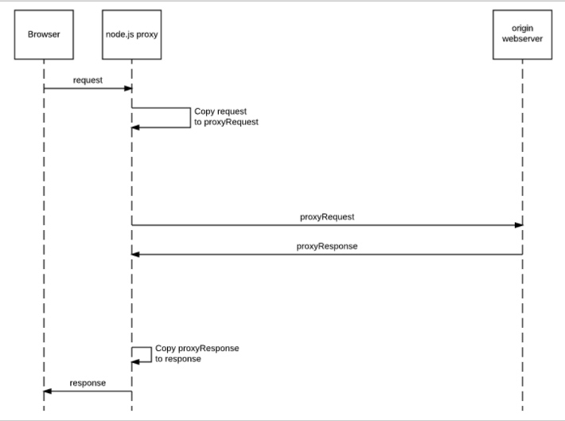
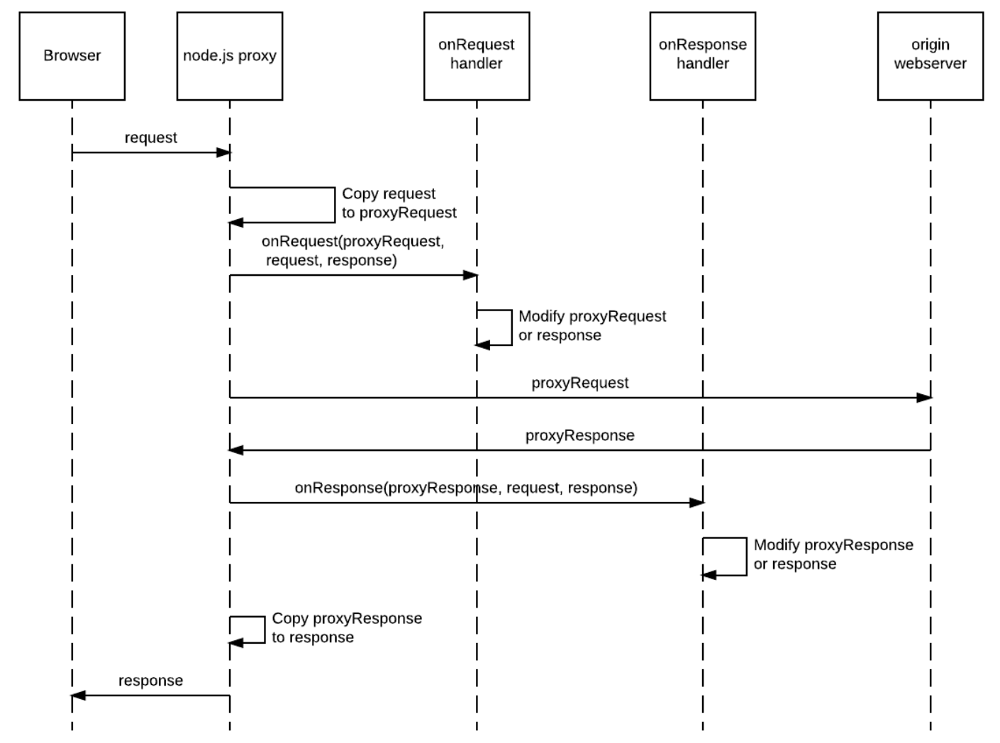

## About Node.js

> [Node.js](https://nodejs.org/) is a Javascript runtime built on Chrome's V8 Javascript engine. Node.js uses an event-driven, non-blocking I/O model that makes it lightweight and efficient. Node.js' package ecosystem, npm, is the largest ecosystem of open source libraries in the world. 

(from the [Node.js site](https://nodejs.org/))

Node is the perfect environment to implement a fast, customisable web proxy, and it allows us to use Javascript to manipulate requests as they pass through the proxy, and responses on the way back.

As it is a fully-fledged development environment, storing state is easy, and you have a full suite of libraries to utilise when crafting business logic*.

(* This can be seen as both a blessing and a curse)

There is a stable proxy implemented in node called [node-js-proxy](https://github.com/nodejitsu/node-http-proxy). This is used by many people for load balancing node applications.

The [Redbird reverse proxy](https://github.com/OptimalBits/redbird) extends node-http-proxy with additional features that make it a good platform to use for our purposes.

The node proxy works just like any standard proxy. Requests from the browser are turned into proxyRequest objects in your code, and can be manipulated. The proxy then forwards the request to the origin webserver, allows manipulation of the response, and returns the reply to the browser.

To see how we implement a simple Node proxy, see [Node.js Proxy](NodeProxy).

To make it easier to manipulate requests and responses, we use a simple chaining of javascript 'handler' objects, each object fixing a particular vulnerability.

The onRequest and onResponse handlers can modify the data sent to or from the origin webserver.

See [Node.js Proxy Handlers](NodeProxyHandlers) for more information about how to lay out your handler.

