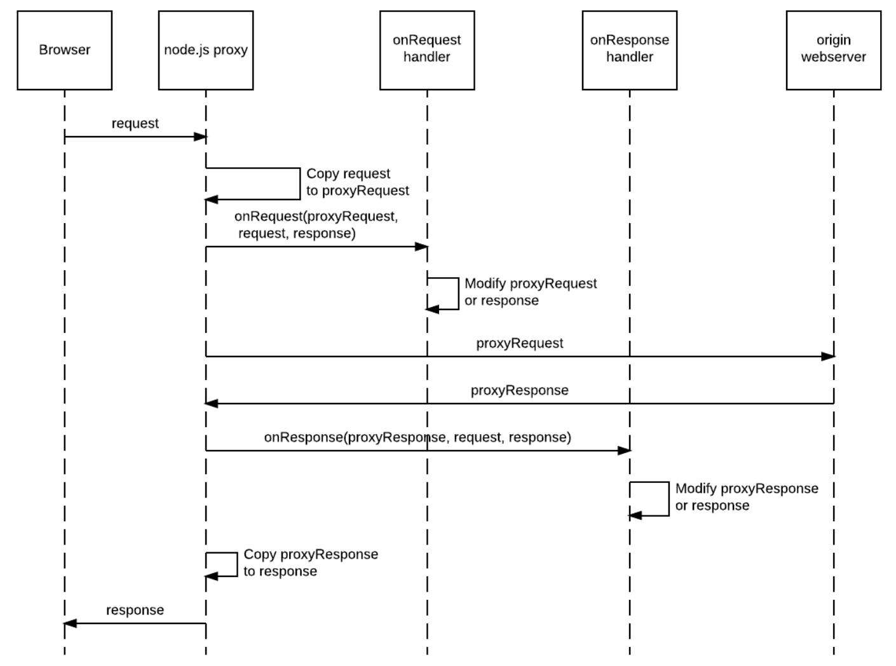

## Node.js Proxy Handlers

To make it easier to manipulate requests and responses, we use a simple chaining of javascript 'handler' objects, each object fixing a particular vulnerability.

The onRequest and onResponse handlers can modify the data sent to or from the origin webserver.




A minimal handler object looks like this:

```JavaScript
exports.onRequest = function (options) {
    return function exampleOnRequest(proxyRequest, request, response, options) {
    	// Code goes here
    }
}

exports.onResponse = function (options) {
    return function exampleOnResponse(proxyResponse, request, response, options) {
    	// Code goes here
    }
}
```

To include it in your code, you will first require the module:

```JavaScript
var example = require('./example');
```

And then attach it to the proxy object:

```JavaScript
reverseProxy.proxy.on('proxyReq', example.onRequest());
reverseProxy.proxy.on('proxyRes', example.onResponse());
```

The order that handlers are attached the proxy matters - requests are processed in the same order they are attached.