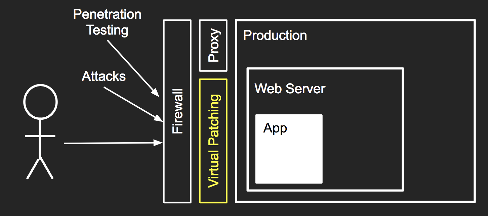

## Welcome to "Let me secure that for you!"

Virtual Patching is a great technique for quickly patching security vulnerabilities or weaknesses in your website, without having to touch the web server!

<dl>
<dt>Virtual Patching:</dt>
<dd>Prevent the exploitation of a known vulnerability</dd>
</dl>

A virtual patching layer can sit in front of your web server, acting as a reverse proxy in front of the application. If any vulnerabilities or weaknesses are discovered by penetration testing or attack traffic, then the virtual patching layer can neuter the effects of the attack or address the weakness.

## Learn more

* Presentation at Appsec Day AU 2017:
  * [Slides (Google Slides)](https://docs.google.com/presentation/d/1O-TqtVjRZHw8dzwZZ5jG7VZkJGv0WZ8dPq6qfMiIq_c/edit?usp=sharing)
  * [Slides (PDF, 2mb)](presentations/2017-09-09-AppsecAU-lmstfu-KirkJackson.pdf)
  * [Video (YouTube, 57min)](https://www.youtube.com/watch?v=ErRu8_iZd14)
* [What is lmstfu?](WhatIsLMSTFU)
* [Vulnerabilities or Weaknesses](VulnerabilitiesOrWeaknesses)
* [How to address vulnerabilities](AddressVulnerabilities)
* Mod Security:
  * [About Mod Security](ModSecurity)
  * [Laying out your SecRules](SecRuleLayout)
  * [Running CRS rules only on certain parameters](CRS-SpecificParams)
* Virtual Patches:
  * [Blocking Requests](BlockingRequests)
  * [Blocking Urls](BlockUrl)

