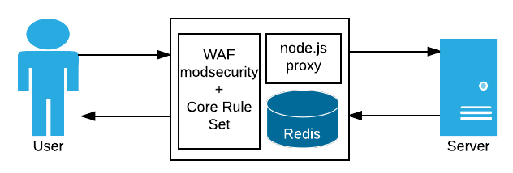

## Welcome to "Let me secure that for you!"

Virtual Patching is a great technique for quickly patching security vulnerabilities or weaknesses in your website, without having to touch the web server!

> ***Virtual Patching:***
> 
> *Prevent the exploitation of a known vulnerability*

A virtual patching layer can sit in front of your web server, acting as a reverse proxy in front of the application. If any vulnerabilities or weaknesses are discovered by penetration testing or attack traffic, then the virtual patching layer can neuter the effects of the attack or address the weakness.

### What is lmstfu?

"Let me secure that for you!" is a reference architecture that demonstrates the virtual patching approach using open source tools and configuration examples.

Sitting between the user and the web server, two proxy layers receive and forward requests to the server, and then return responses to the user.

The first layer is the [ModSecurity](https://www.modsecurity.org/) web application firewall running inside [Apache](https://www.apache.org/) http server. This is an open source module that allows rules to be configured to block, modify or otherwise inspect web traffic.

Out of the box, ModSecurity doesn't do much - it needs rules to be configured to unleash it's power. The [OWASP ModSecurity Core Rule Set](https://coreruleset.org/) is a set of attack detection rules that have been collated and tuned by experts.

[Read more about ModSecurity and how we use it
](ModSecurity)

The second layer is a node.js proxy built on the [Redbird reverse proxy](https://github.com/OptimalBits/redbird) node.js package. This extends [node-js-proxy](https://github.com/nodejitsu/node-http-proxy) with extra features.

node.js allows us to perform additional logic to address the vulnerabilities or weaknesses that can't be fixed in ModSecurity.

[Read more about node.js and how we use it
](NodeJS)

